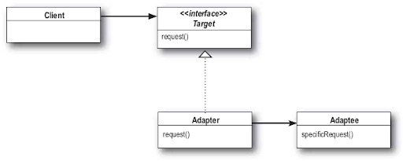
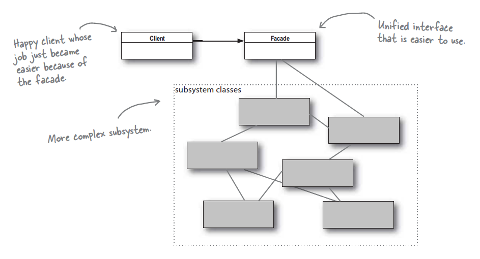

# Паттерны Адаптер и Фасад

> **Паттерн Адаптер** преобразует интерфейс класса к другому интерфейсу, на который рассчитан клиент.
Адаптер обеспечивает совместимую работу классов, невозможную в обычных условиях из-за несовместимости интерфейсов.

Итак, чтобы использовать клиента с несовместимым интерфейсом, мы создаем адаптер, который выполняет преобразование.
Таким образом клиент отделяется от реализованного интерфейса; 
и если мы ожидаем, что интерфейс будет изменяться со временем, адаптер инкапсулирует эти изменения, 
чтобы клиента не приходилось изменять каждый раз, когда ему потребуется работать с новым интерфейсом.

> **Паттерн Фасад** предоставляет унифицированный интерфейс к группе интерфейсов подсистемы. 
Фасад определяет высокоуровневый интерфейс, уролщающий работу с подсистемой.

При использовании паттерна Фасад мы создаем класс, который упрощает и унифицирует набор более сложных классов, 
образующих некую подсистемы. В отличие от многих других паттернов, Фасад относительно прост; 
в нем нет умопомрачительных абстракций, в которых приходится подолгу разбираться. 
Определение паттерна Фасад четко и недвусмысленно говорит, 
что целью фасада является упрощение работы с подсистемой за счет использования упрощенного интерфейса.

- Декоратор - не изменяет интерфейс, но добавляет новые обязанности
- Адаптер - преобразует один интерфейс к другому
- Фасад - упрощает интерфейс