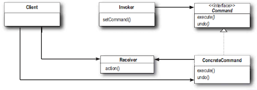

#Паттерн Команда

> **Паттерн команда** инкапсулирует запрос в виде объекта, делая возможной параметризацию клиентских объектов с другими 
запросами, организацию очереди или регистрацию запросов, а также поддержку отмены операций.

Объект команды *инкапсулирует запрос* посредством привязки набора операций к конкретному получателю. Для этого информация
об операции и получателе "упаковывается" в объекте с единственным методом execute(). При вызове метод execute() выполняет 
операцию с данным получателем. Внешние объекты не знают, какие именно операции выполняются, и с каким получателем; они знают,
что при вызове метода execute() их запрос будет заполнен.

