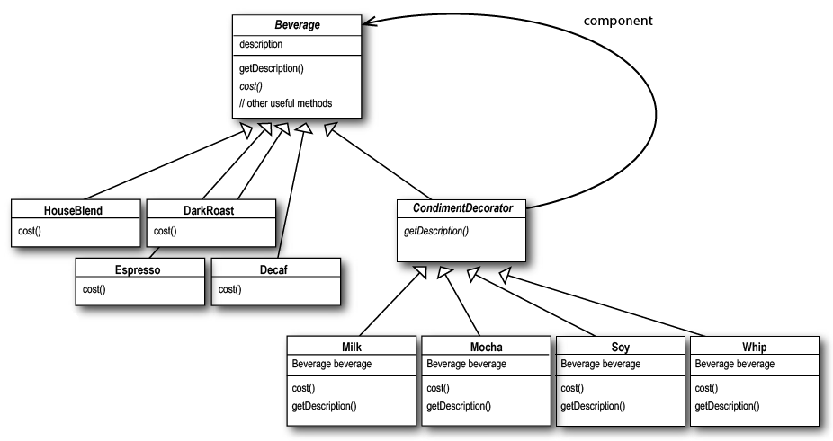

# Паттерн Декоратор

> **Паттерн Декоратор** динамически наделяет объект новыми возможностями и является гибкой альтернативой субклассированию
в области расширения функциональности.

Наша цель заключается в том, чтобы классы можно было легко расширять новым поведением без изменения существующего кода.
Что это нам дает? Архитектуры, устойчивые к изменениям и достаточно гибкие для поддержки новой функциональности 
в соответствии с изменившимися требованиями.

## Характеристики Декоратора
- Декораторы имеют тот же супертип, что декорируемые объекты.
- Объект можно "завернуть" в один или несколько декораторов.
- Так как декоратор относится к тому же супертипу, что и декорируемый объект, 
  мы можем передать декорированный объект вместо исходного.
- Декоратор добавляет свое поведение до и (или) после делегирования операций декорируемому объекту, выполняющему остальную
работу.
- Объект может быть декорирован в любой момент времени, так что мы можем декорировать объекты динамически и с произвольным
количеством декораторов.
  
Если код зависит от типа конкретного компонента, декораторы нарушат его работоспособность. Пока код пишется для типа 
абстрактного компонента, использование декораторов остается прозрачным для кода. Впрочем, если вы начинаете программировать
на уровне компонентов, вам стоит переосмыслить архитектуру приложения и использования в нем декораторов.

В паттерне декоратор возрастает количество объектов, а следовательно, и опасность проблем, связанных с ошибками программирования.
Однако декораторы обычно создаются при использовании других паттернов (таких, как Фабрика или Строитель). Создание конкретных
компонентов с декораторами в них хорошо инкапсулировано, а ошибки такого рода маловероятны.

Декораторы предназначены для расширения поведения декорируемых объектов. Получение информации с других уровней цепочки декораторов
выходит за рамки их традиционного назначения. Впрочем, такие ситуации возможны - допустим, декоратор CondimentPrettyPrint
может разбирать итоговое описание и выводить его в нужном виде. Для упрощения реализации приведенного примера метод getDecription()
может возвращать объект ArrayList с описаниями.

