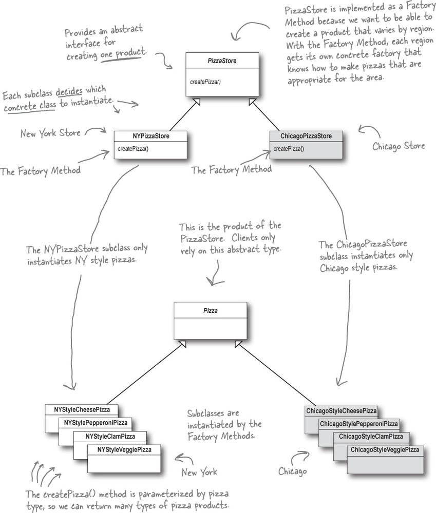
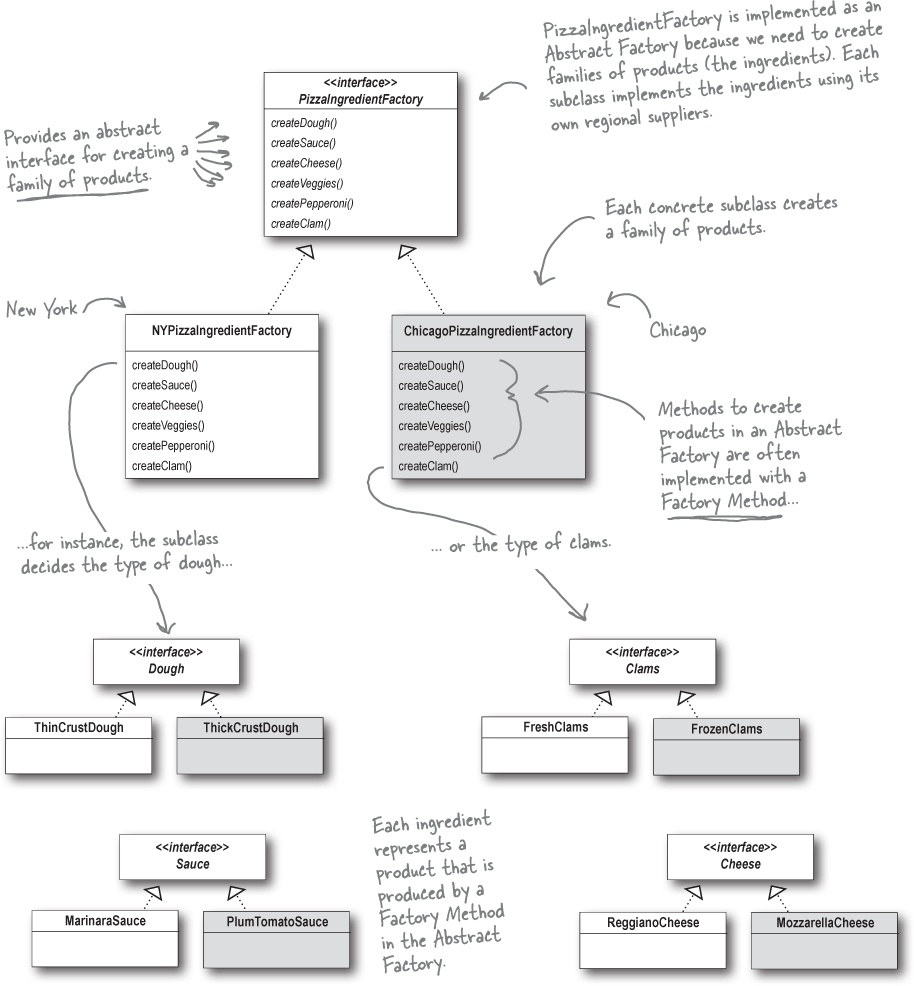

# Фабричный метод и Абстрактная фабрика

> **Паттерн Фабричный Метод** определяет интерфейс создания объекта, но позволяет субклассам выбрать класс создаваемого
экземпляра. Таким образом, Фабричный метод делегирует операцию создания экземпляра субклассам.

Паттерн Фабричный Метод, как все остальные разновидности фабрик, предоставляет способ инкапсуляции создания экземпляров
конкретных типов.

Разработчики часто говорят, что Фабричный метод позволяет субклассам выбрать тип создаваемого экземпляра. Имеется в виду
не то, что паттерн позволяет субклассам принимать самостоятельное решение во время выполнения, а то, что класс-создатель
не обладает информацией о фактическом типе создаваемых продуктов (последний определяется исключительно типом используемого
субкласса).

> **Паттерн Абстрактная Фабрика** предоставляет интерфейс создания семейств взаимосвязанных или взаимозависимых объектов
без указания их конкретных классов.

Благодаря паттерну Абстрактная Фабрика клиент может использовать абстрактный интерфейс для создания логически связанных 
продуктов, не располагая информацией о конкретных создаваемых продуктах. Таким образом клиент отделяется от подробностей 
конкретного продукта.

Методы Абстрактной Фабрики часто реализуются как фабричные методы. И это вполне логично, не правда ли? Задача Абстрактной
Фабрики - определить интерфейс для создания набора продуктов. Каждый метод этого интерфейса отвечает за создание конкретного 
продукта, и мы реализуем субкласс Абстрактной Фабрики, который предоставляет эти реализации. Таким образом, фабричные методы
являются естественным способом реализации методов продуктов в абстрактных фабриках.