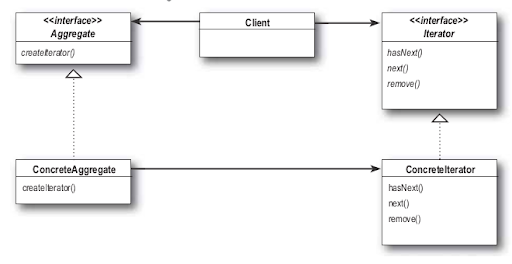
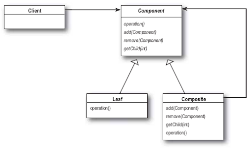

# Паттерны Итератор и Компоновщик

> **Паттерн Итератор** предоставляет механизм последовательного перебора элементов коллекции без раскрытия ее внутреннего
представления.

Применение паттерна Итератор имеет и другое важное последствие для архитектуры системы: ответственность за перебор 
элементов передается от объекта коллекции объекту итератора. Это обстоятельство не только упрощает интерфейс и реализацию
коллекции, но и избавляет коллекцию от посторонних обязанностей (ее главной задачей является управление объектами, 
а не перебор).

> **Паттерн Компоновщик** объединяет объекты в древовидные структуры для представления иерархий "часть/целое".
Компоновщик позволяет клиенту выполнять однородные операции с отдельными объектами и их совокупностями.

Мы можем использовать этот паттерн для того, чтобы "выполнять однородные операции с отдельными объектами и их комбинациями".
Что это означает? Если у вас есть древовидная структура из меню, подменю (и, возможно, под-подменю) с элементами,
любое меню представляет собой "комбинацию", так как оно может содержать другие меню и команды меню. Отдельными объектами
являются только элементы меню - они не могут содержать других объектов. Применение в архитектуре паттерна Компоновщик 
позволит нам написать простой код, который применяет одну и ту же операцию (например вывод!) ко всей структуре меню.

