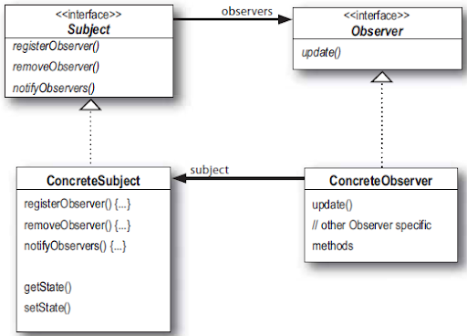

# Паттерн Наблюдатель

> ***Паттерн Наблюдатель*** определяет отношение "один-ко-многим" между объектами таким образом, 
что при изменении состояния одного объекта происходит автоматическое оповещение и обновление всех зависимых объектов.

Субъект и наблюдатели определяют отношение "один-ко-многим". Наблюдатели зависят от субъекта: при изменении состояния
последнего наблюдатели получают оповещения. В зависимости от способа оповещения также возможно обновление состояния 
наблюдателей.

> Если два объекта могут взаимодействовать, не обладая практически никакой информации друг о друге, 
такие объекты называют **слабосвязанными**.

### В архитектуре паттерна Наблюдатель между субъектами и наблюдателями существует слабая связь. Почему?

**Единственное, что знает субъект о наблюдателе, - то, что тот реализует некоторый интерфейс** (Observer).
Ему не нужно знать ни конкретной класс наблюдателя, ни его функциональность... ничего.

**Новые наблюдатели могут добавляться в любой момент**. Так как субъект зависит только от списка объектов, 
реализующих интерфейс Observer, вы можете добавлять новых наблюдателей по своему усмотрению. Любого наблюдателя во время
выполнения можно заменить другим наблюдателем или исключить его из списка - субъект этого не заметит.

**Добавление новых типов наблюдателей не требует модификации субъекта.** Допустим, у нас появился новый класс, который
должен стать наблюдателем. Вносить изменения в субъект не потребуется - достаточно реализовать интерфейс Observer в новом
классе и зарегистрировать его в качестве наблюдателя. Субъект должен доставлять оповещения любому объекту, реализующий
интерфейс Observer.

**Субъекты и наблюдатели могут повторно использоваться независимо друг от друга.** Между ними не существует сильных связей,
что позволяет повторно использовать их для других целей.

**Изменения в субъекте или наблюдателе не влияют на другую сторону.** Благодаря слабым связям мы можем вносить любые изменения
на любой из двух сторон - при условии, что объект реализует необходимый интерфейс субъекта или наблюдателя.

