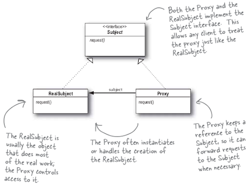

# Паттерн Заместитель

> **Паттерн заместитель** предоставляет суррогатный объект, управляющий доступом к другому объекту.

Subject - интерфейс для взаимодействия с RealSubject и Proxy. Реализация общего интерфейса позволяет использовать
Proxy вместо RealSubject во всех операциях.

RealSubject - объект, выполняющий фактическую работу. Proxy представляет этот объект и управляет доступом к нему.

Заместитель Proxy хранит ссылку на RealSubject. В некоторых случаях Proxy отвечает за создание и уничтожение RealSubject.
Клиенты взаимодействуют с RealSubject через Proxy. Так как Proxy и RealSubject реализуют общий интерфейс (Subject),
Proxy может использоваться повсюду вместо RealSubject. Proxy также управляет доступом к RealSubject; это может быть
полезно, если объект RealSubject работает на удаленном компьютере, если создание его экземпляров связано с большими
затратами, или доступ к нему должен быть тем или иным образом защищен.

