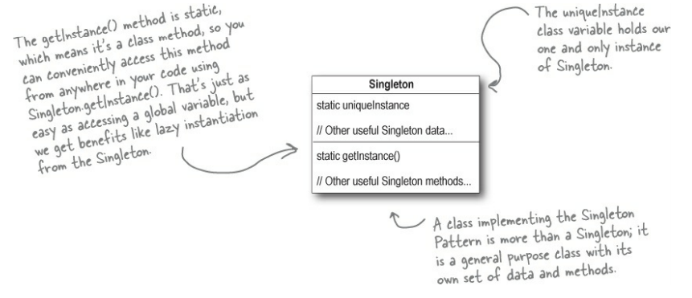

# Паттерн Одиночка

>**Паттерн Одиночка** гарантирует, что класс имеет только один экземпляр, и предоставляет глобальную точку доступа к этому
экземпляру.

Мы берем существующий класс и разрешаем ему создавать только один экземпляр. Кроме того, мы запрещаем любым другим 
классам произвольно создавать новые экземпляры этого класса. Чтобы получить экземпляр, необходимо обратиться с запросом 
к самому классу.

Кроме того, паттерн предоставляет глобальную точку доступа к экземпляру: обратившись с запросом к классу в любой точке 
программы, вы получите ссылку на единственный экземпляр. Как было показано выше, возможно отложенное создание экземпляра,
что особенно важно для объектов, создание которых сопряжено с большими затратами ресурсов.

