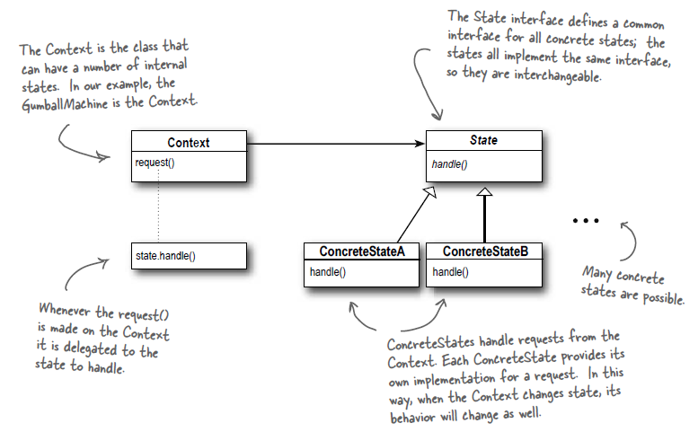

# Паттерн состояние

> **Паттерн состояние** управляет изменением поведения объекта при изменении его внутреннего состояния. 
Внешне это выглядит так, словно объект меняет свой класс.

Поскольку паттерн инкапсулирует состояние в отдельных классах и делегирует операции объекту, представляющему текущее
состояние, поведение изменяется вместе с внутренним состоянием. Так, если автомат из нашего примера находится в
состоянии NoQuarterState, и в него бросают монетку, его поведение (автомат принимает монетку) будет отличаться от
поведения в состоянии HasQuarterState (автомат отвергает монетку).

Но что со второй частью определения? Что значит "словно объект меняет свой класс"? Представьте происходящее с точки
зрения клиента: если используемый объект полностью изменяет свое поведение, для клиента это равносильно переходу на
работу с объектом другого класса. Конечно, на практике изменение класса имитируется простым переключением на другой
объект состояния, задействованный в композиции.

