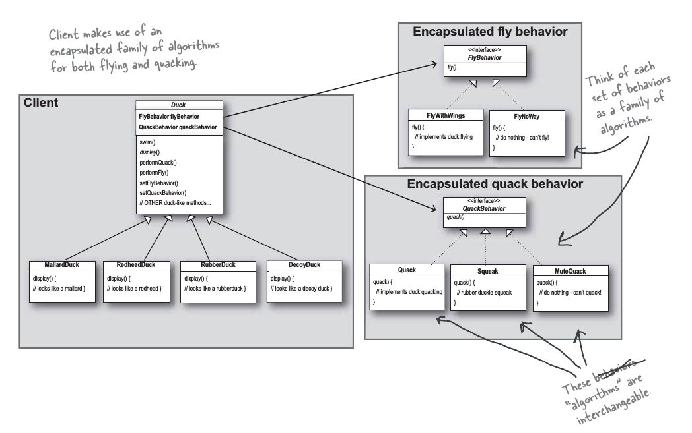

# Паттерн "Стратегия"

> ***Паттерн стратегия*** определяет семейство алгоритмов, инкапсулирует каждый из них и обеспечивает их взаимозаменяемость.
Он позволяет модифицировать алгоритмы независимо от их использования на стороне клиента.

В какой бы среде, над каким бы проектом, на каком угодно языке вы бы ни работали - изменения неизменно будут присутствовать
в вашей программе.

Наследование не всегда может подойти, потому что поведение может изменяться в субклассах, а некоторые аспекты поведения
присутствуют не во всех субклассах. Идея с интерфейсами на первый взгляд выглядит заманчиво - но интерфейсы Java не имеют
реализации, что исключает повторное использование кода. И если когда-нибудь потребуется изменить аспект поведения, вам 
придется искать и изменять его во всех субклассах, где он определяется, - скорее всего, с внесением *новых* ошибок.

> Выделите аспекты приложения, которые могут изменяться, и отделите их от тех, которые всегда остаются постоянными.

Иначе говоря, если некий аспект кода изменяется, то его необходимо отделить от тех аспектов, которые остаются неизменными.

Другая формулировка того же принципа: ***выделите переменные составляющие и инкапсулируйте их, чтобы позднее 
их можно было изменять или расширять без воздействия на постоянные составляющие.***

### Проектирование переменного поведения

***Как же спроектировать набор классов, реализующих переменные аспекты поведения?***

Для представления каждого аспекта поведения будет использоваться интерфейс, а каждая реализация аспекта поведения будет 
представлена реализацией этого интерфейса.

Мы создаем набор классов, единственным смыслом которых является представление некоторого поведения. И теперь интерфейс
поведения реализуется *классом поведения*.

Такой подход отличается от того, что делалось прежде, когда поведение предоставлялось либо конкретной реализацией в
суперклассе, либо специализированной реализацией в самом субклассе. Мы были вынуждены использовать именно эту реализацию, 
и изменить поведение было невозможно (без написания дополнительного кода).

Ниже изображена структура классов, которая уже рассматривается не как *совокупность аспектов поведения*, а как *семейство
алгоритмов*.

