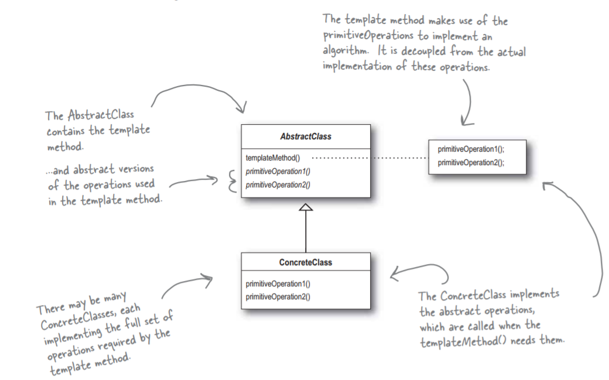

# Паттерн Шаблонный метод

> **Паттерн Шаблонный Метод** задает "скелет" алгоритма в методе, оставляя определение реализации некоторых шагов субклассам.
Субклассы могут переопределять некоторые части алгоритма без изменения его структуры.

Основной задачей паттерна является создание шаблона алгоритма. Что такое "шаблон алгоритма"?
Как было показано ранее, это метод; а конкретнее - метод, определяющий алгоритм в виде последовательности шагов.
Один или несколько шагов определяются в виде абстрактных методов, реализуемых субклассами. Таким образом гарантируется
неизменность структуры алгоритма при том, что часть реализации предоставляется субклассами.

- Шаблонный метод - субклассы определяют реализацию шагов алгоритма;
- Стратегия - инкапсуляция взаимозаменяемых вариантов поведения и выбор нужного варианта посредством делегирования;
- Фабричный метод - субклассы решают, какие конкретные классы создавать.